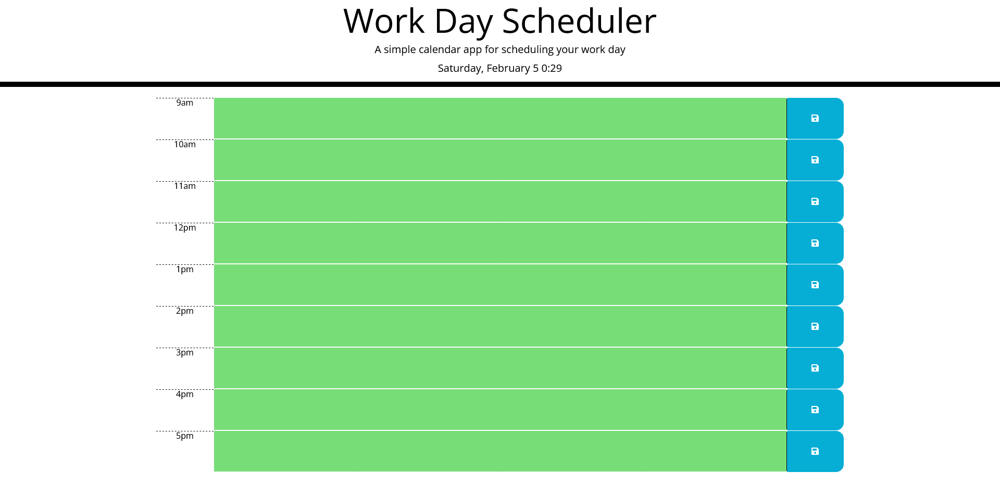

# Work Day Scheduler Starter Code

## Purpose
Make a scheduler that allows you to save tasks to localeStorage for each hour of the work day.

## Technology Used
HTML, CSS, JavaScript, DayJs, Jquery, Bootstrap

## Website
https://sam-clark1.github.io/work-day-scheduler/

## Screenshot

## Description
- Shows work hours which are 9am-5pm.
- Times are color coded to display if they are in the past(gray), present(red), or future(red).
- Can add/delete text to/from time blocks by clicking them and then pressing the save button which saves the data to local storage.
